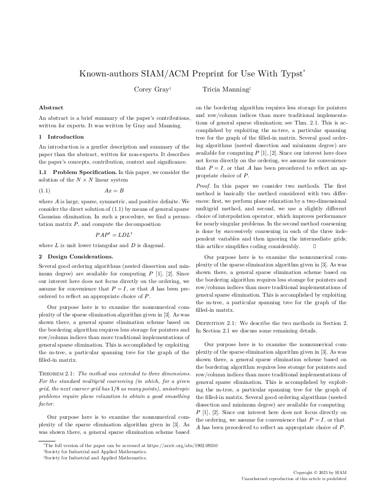
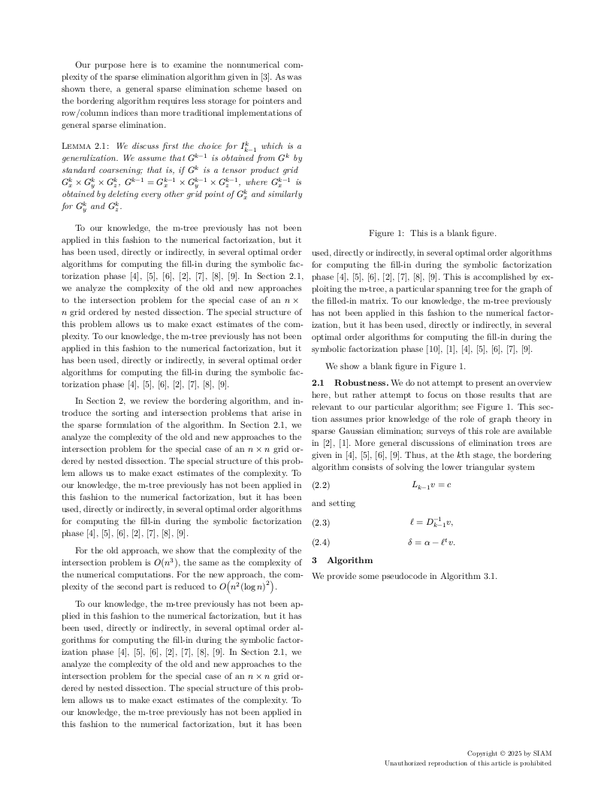
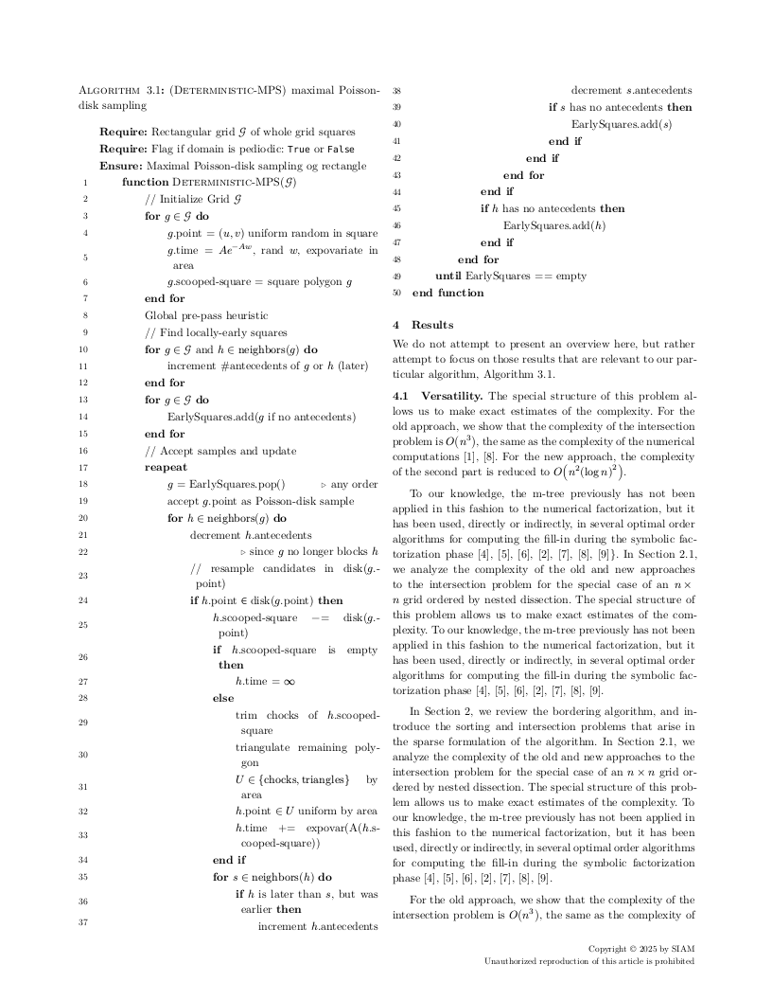
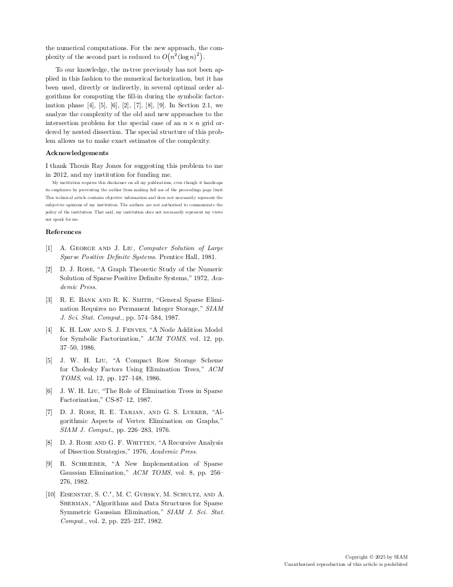

# The `simple-siam` Typst package

A Typst template for SIAM paper submissions

<p align="center">




</p>

<details>
<summary>About the name</summary>

- `typst-simple-siam` is the name of the GitHub repo, `simple-siam` is the name of the Typst template
- The Typst template name does not contain `typst`, because it is redundant[^typst_template_naming]
- The Typst template name is not just `siam`, because it is not an official template, thus the name must start with a non-descriptive part[^typst_template_naming]

[^typst_template_naming]: https://github.com/typst/packages?tab=readme-ov-file#submission-guidelines

</details>

## Template adaptation checklist

- [x] Fill out `README.md`
  - Change the `my-package` package name, including code snippets
  - Check section contents and/or delete sections that don't apply
- [x] Check and/or replace `LICENSE` by something that suits your needs
- [x] Fill out `typst.toml`
  - See also the [typst/packages README](https://github.com/typst/packages/?tab=readme-ov-file#package-format)
- [ ] Adapt Repository URLs in `CHANGELOG.md`
  - Consider only committing that file with your first release, or removing the "Initial Release" part in the beginning
- [ ] Adapt or deactivate the release workflow in `.github/workflows/release.yml`
  - to deactivate it, delete that file or remove/comment out lines 2-4 (`on:` and following)
  - to use the workflow
    - [ ] check the values under `env:`, particularly `REGISTRY_REPO`
    - [ ] if you don't have one, [create a fine-grained personal access token](https://github.com/settings/tokens?type=beta) with [only Contents permission](https://stackoverflow.com/a/75116350/371191) for the `REGISTRY_REPO`
    - [ ] on this repo, create a secret `REGISTRY_TOKEN` (at `https://github.com/[user]/[repo]/settings/secrets/actions`) that contains the so created token

    if configured correctly, whenever you create a tag `v...`, your package will be pushed onto a branch on the `REGISTRY_REPO`, from which you can then create a pull request against [typst/packages](https://github.com/typst/packages/)
- [x] remove/replace the example test case
- [x] (add your actual code, docs and tests)
- [ ] remove this section from the README

## Getting Started

> [!IMPORTANT]
> This template is not published yet, you cannot access it from `@preview/`, but you can download [`src/lib.typ`](src/lib.typ) and use it in your project.


From the CLI:
```bash
typst init @preview/simple-siam
```

From the Typst web app:
```typ
#import "@preview/simple-siam:0.1.0": conf

#show: doc => conf(
  title: [A Typst template for SIAM paper submissions],
  authors: [Sébastien Mestrallet],
  abstract: [See #link("https://github.com/sebmestrallet/typst-simple-siam")],
  doc,
)

= First section

#lorem(50)
```

## Theorems & algorithms

Based on third-party Typst packages, this template allows to insert formatted theorem/proof/definition/lemma environments, as well as algorithms:

```typ
#import "lib.typ": conf, theorem, definition, lemma, thmrules, proof, pseudocode-list, algorithm
#show: thmrules

#show: doc => conf(
  title: [A Typst template for SIAM paper submissions],
  authors: [Sébastien Mestrallet],
  abstract: [See #link("https://github.com/sebmestrallet/typst-simple-siam")],
  doc,
)

= A theorem

#theorem[
  Here the theorem formulation
]

= An algorithm

#algorithm(
  pseudocode-list(
    numbered-title: #smallcaps[(My Algorithm)],
    stroke: none,
    booktabs: false,
    indentation: 2em
  )[
    - *Require:* Some input $a$
    - *Require:* Some input $b$
    + Here the algorithm definition
  ]
)
```

## Files

- [`src/lib.typ`](src/lib.typ): provide the `conf(title,authors,abstract,doc)` function to format a paper
- [`src/main.typ`](src/main.typ): use `conf()` to reproduce the outputs of `ltexpprt_anonymous-submission.tex` & `ltexpprt_accepted-submission.tex` from the official template
- [`src/bib.yml`](src/bib.yml): 	transcoding of `ltexpprt_references.bib` from the official template to the [Hayagriva](https://github.com/typst/hayagriva/blob/main/docs/file-format.md) format
- [`src/siam.csl`](src/siam.csl): [Citation Style Language](https://citationstyles.org/) for the bibliography, based on the [IEEE](https://github.com/citation-style-language/styles/blob/master/ieee.csl) one (modified `<macro name="author">` to have small caps)

## Dependencies

- [`ctheorems`](https://typst.app/universe/package/ctheorems) ([sahasatvik/typst-theorems](https://github.com/sahasatvik/typst-theorems)) for numbered theorem environments, by [Satvik Saha](https://github.com/sahasatvik), [Rory Molinari](https://github.com/rmolinari), [Michael Hutchinson](https://github.com/MJHutchinson) and [DVDTSB](https://github.com/DVDTSB) [[MIT](https://github.com/sahasatvik/typst-theorems/blob/main/LICENSE)]
- [`lovelace`](https://typst.app/universe/package/lovelace) ([andreasKroepelin/lovelace](https://github.com/andreasKroepelin/lovelace)) for pseudocode, by [Andreas Kröpelin](https://github.com/andreasKroepelin) and contributors [[MIT](https://github.com/andreasKroepelin/lovelace/blob/main/LICENSE)]

They are imported with `#import "@preview/{name}:{version}` in [`src/lib.typ`](src/lib.typ).

## Ressources

TeX sources of the official template:
- The [SIAM two-column template](https://internationalmeshingroundtable.com/assets/files/imr33/templates.zip) referenced for the [SIAM International Meshing Roundtable Workshop 2025](https://internationalmeshingroundtable.com/imr33/call-for-papers/#formatting-requirements)
- The [SIAM Macros](https://epubs.siam.org/journal-authors#macros) on the SIAM website
- The [2019 SIAM style manual](https://epubs.siam.org/pb-assets/files/SIAM_STYLE_GUIDE_2019.pdf) on the SIAM website

How to create and publish a Typst template package:
- The motivation and recommended interface for templates in the [official tutorial](https://typst.app/docs/tutorial/making-a-template/)
- The in-depth format requirements in the [typst/packages](https://github.com/typst/packages) README
- Do as the [templates directly maintained by the Typst team](https://github.com/typst/templates)
- Use the [typst-package-template](https://github.com/typst-community/typst-package-template) GitHub template from [@typst-community](https://github.com/typst-community)

## Differences with the official TeX template

See [open issues with the `compliance` label](https://github.com/sebmestrallet/typst-simple-siam/issues?q=sort%3Aupdated-desc+is%3Aopen+label%3Acompliance)

## License

[MIT-0](LICENSE)